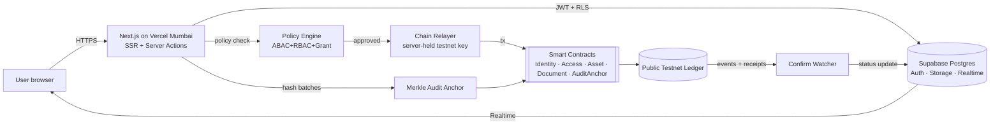

# BEL TrustGrid — Product Requirements Document 2.0

| | |
|---|---|
| **Project** | BEL TrustGrid — Blockchain-Based Secure Platform for Identity, Access Control and Digital Asset Management |
| **Event / PS** | Smart India Hackathon 2026 · Problem Statement **SIH26125** · Bharat Electronics Limited · Software · Blockchain & Cybersecurity |
| **Version** | 2.0 (rebuild of the CodeX prototype) |
| **Goal** | Win the SIH 2026 online submission round |
| **Build tool** | Google Antigravity (agent-driven) |
| **Data policy** | All data is **fictional demonstration data**. No real BEL, defence or personal data. |

---

## 0. How to use this PRD in Antigravity

1. Put **§0.1 Agent Rules** into the project's rules file so every agent session obeys them.
2. Build **phase by phase** (§14). At the start of each phase, paste that phase's kickoff prompt, ask for a *plan first*, review it, then let the agent build.
3. Every feature has **acceptance criteria (AC)**. Ask the agent to write a Playwright test per AC and to show a Lighthouse report before a phase is called done.
4. Items marked **[P0]** are must-have for submission, **[P1]** strongly recommended, **[P2]** stretch.

### 0.1 Agent Rules (paste into project rules)

- Never commit secrets. Use `.env.local` / Vercel env vars. The blockchain relayer key is **testnet-only** and server-side only. Never expose `SUPABASE_SERVICE_ROLE_KEY` or the relayer key to the browser.
- No personal data on-chain. Only hashes, pseudonymous DIDs, role/classification codes and timestamps go on-chain (privacy-by-design; aligns with India's DPDP Act, 2023).
- Every mutation (insert / update / soft-delete / grant / revoke / login / denial) must create an `audit_logs` row. Chain-flagged actions must also create a `chain_tx` row.
- Row Level Security (RLS) is **on for every table**. The UI never decides access; the database and server do.
- All user-facing text is plain English first. Every blockchain term (DID, NFT, hash, smart contract, ledger, block, gas) gets a one-line glossary tooltip.
- Do **not** use the State Emblem of India or the official BEL logo. Use a text wordmark "BEL TrustGrid" and the footer line "SIH 2026 prototype — fictional data — not an official BEL product".
- Respect the performance budget in §5.3. Animate only `transform` and `opacity`. Honour `prefers-reduced-motion`.
- Prefer small, lazy-loaded dependencies. Justify any dependency over 30 KB gzipped.

---

## 1. Context

### 1.1 Problem statement (as visible)
Organizations rely on centralized identity and access systems that are single points of failure, and ownership of digital/physical assets is tracked in disconnected systems. The brief asks for a blockchain framework combining **decentralized identity (DID)**, **smart-contract access control**, and **NFT-based digital asset ownership**, where each user gets a DID verified by cryptographic proof, assets are NFTs allocated to identities, and smart contracts govern all operations.

> The screenshot of the problem statement cuts off mid-paragraph. Paste the remaining text so §16 (traceability) can be completed.

### 1.2 What exists today (v1)
React 19 + Vite frontend, Express API, SQLite/Turso, Solidity + Hardhat contracts (`IdentityRegistry`, `AccessControlManager`, `AssetRegistry` ERC-721), 4 login types, 13 demo roles, 13 demo projects, an identical 15-feature workspace for every login, optional MetaMask `personal_sign`, deployed on Vercel (frontend) + Render (backend).

### 1.3 Diagnosis of the five problems (to be confirmed in Phase 0)

| Symptom | Evidence / likely cause | Confidence |
|---|---|---|
| Blank/slow first load | The live page's HTML is an **empty client-rendered shell** — nothing paints until the full JS bundle downloads and runs | Observed |
| Features "not functioning" | The repo README runs the chain on a **local Hardhat node (port 8545)**. A local node cannot exist on Vercel/Render, so any feature that touches the chain will fail or hang in production | High |
| Long waits on API calls | Render free-tier cold starts (sleeping server); SQLite/Turso round-trips; chain RPC calls on the request path | High |
| README vs overview mismatch | README describes 3 personas; the overview describes 13 roles/4 login types — docs and code have drifted | Observed |
| Evaluators can't "see" blockchain | Chain activity is hidden behind a REST API; the UI shows tables, not proof | Observed |

### 1.4 Vision
*"Every action in BEL TrustGrid leaves proof you can see, click and verify yourself."*

TrustGrid 2.0 is a fast, government-grade, role-aware workspace where an evaluator with **zero blockchain knowledge** can, in under 5 minutes, create a DID, request access, watch a smart contract approve it, open a document, tamper with it, and watch verification fail.

### 1.5 Non-goals
Real classified data; production key custody (HSM) — described in the roadmap only; mobile native apps; mainnet deployment.

---

## 2. Success metrics

| Metric | Target |
|---|---|
| Landing page LCP (throttled Fast 4G, India region) | ≤ 2.0 s |
| Route change (after first load) | ≤ 300 ms perceived |
| API p95 (excluding chain confirmation) | ≤ 300 ms |
| Chain action: UI feedback | Instant (optimistic) · confirmation shown in ≤ 10 s |
| Lighthouse (Perf / A11y / Best Practices / SEO) | ≥ 90 / ≥ 95 / ≥ 95 / ≥ 90 |
| Evaluator "aha" test | A first-time user completes the *Evaluator Scenario* (§7.9) unaided in ≤ 5 min |
| Role isolation | 0 cross-role data leaks in automated RLS tests |
| Feature health | 100 % of listed features pass Phase-0 QA matrix and Playwright e2e |

---

## 3. Users, roles and BEL hierarchy (illustrative)

> The hierarchy below is modelled on the public structure of a Navratna defence PSU (Board → Functional Directors → Unit Heads → Department Heads → Officers) and is **illustrative**. Names are fictional. Verify unit/SBU names against BEL's public site before publishing.

### 3.1 Hierarchy tiers

| Tier | Role (demo) | Scope | Reports to | Typical authority |
|---|---|---|---|---|
| T0 | Chairman & Managing Director (CMD) — *portfolio viewer* | Whole organization | Board / Ministry (external) | Read-only portfolio, risk and audit summaries; ratifies exceptional (Secret-demo) cross-unit access |
| T1 | Functional Directors: Finance, HR, R&D, Operations, Marketing/BD | Function across units | CMD | Approve cross-department access in their function; sign off high-value records |
| T2 | Unit Head (General Manager), **Chief Vigilance Officer**, **CISO / ERP Administrator** (Rohan Sharma) | Unit-wide; CVO oversight read-only everywhere; CISO platform authority | Functional Director / CMD | Unit-level approvals; CISO = full platform admin; CVO = read-all + raise alerts, cannot modify |
| T3 | Department Heads (DGM): Procurement, Finance, Production, Quality, R&D, Logistics, HR, Compliance, Internal Audit, Asset Custody Security | Department within a unit | Unit Head | **First approver** for requests to their department's data; grants within scope |
| T4 | Officers / Engineers (existing 13 demo roles, 2 per role) | Own dept + assigned projects | Department Head | Create/upload within assigned projects; request access beyond scope |
| T5 | Trainee / Technician | Assigned tasks only | Officer / Dept Head | View-only on assigned items; no downloads of Confidential |
| EXT-V | Vendor (NovaTech Components Pvt. Ltd. + 2 more) | Own supplier orders | BEL Procurement Officer (sponsor) | Upload delivery evidence, view approved POs |
| EXT-C | Customer (Defence Systems Demo Client + 1 more) | Approved delivery & acceptance | BEL Project Lead (sponsor) | View approved deliveries, digitally sign acceptance |

A **Hierarchy page** (§7.7) renders this as an interactive org chart; clicking a node shows that role's access rights and the data flow it participates in.

### 3.2 Classification, clearance and access levels

- **Document / asset classification:** `Open` · `Restricted` · `Confidential` · `Secret (demo)`. Every document carries a visible badge and a diagonal "FICTIONAL DEMO" watermark.
- **User clearance:** 0–3 matching the classification ladder; set by CISO, anchored on-chain with the DID.
- **Access levels on a grant:** L1 *See that it exists (metadata)* → L2 *View* → L3 *Download* → L4 *Edit / upload new version* → L5 *Approve / delegate*.
- **Decision rule (ABAC + RBAC + explicit grant):**
  `ALLOW` if identity verified **and** not suspended **and** (clearance ≥ classification) **and** (in project/department scope **or** has an active, unexpired grant) **and** (for Secret: two-person approval recorded).
  Role alone **never** grants access (kept from v1 — "Role ≠ Access").

### 3.3 Approval matrix

| Resource class | Requester | Approver chain | Max grant duration |
|---|---|---|---|
| Open | Any in-scope user | None (auto) | Project lifetime |
| Restricted | Same dept, other project | Project Lead | 30 days |
| Restricted | Other dept | Dept Head of owning dept | 14 days |
| Confidential | Any | Dept Head **+** Unit Head (or CISO) | 7 days |
| Secret (demo) | Any | Dept Head **+** Asset-Custody Security Approver (two-person), ratified by CISO | 24 hours |
| Vendor-visible doc | Vendor | Project Lead + Compliance Officer | PO lifetime |
| Customer-visible doc | Customer | Project Lead (flag "customer-visible") | Project lifetime |

Rules: never self-approve; SLA breach (demo: 2 min, production: 24 h) escalates to next tier; **break-glass** emergency access (§7.10) allowed only for T2+ with mandatory justification, instant CISO + CVO alert and post-review.

---

## 4. Scope summary

### 4.1 Priority table

| # | Workstream (your request) | Priority |
|---|---|---|
| 1 | Performance rebuild, working features, **Blockchain X-Ray** explainability | P0 |
| 2 | Government-grade UI/UX, smooth scroll, animations, plain-English copy | P0 |
| 3 | Supabase + fast stack | P0 |
| 4 | Role-specific workspaces, PDF upload, selective document access | P0 |
| 5 | Rich role data, access ladder (Create DID → Request → Access), finished-project reference archive, Admin audit/CRUD control | P0 |
| 6 | Animated data-flow / architecture page | P0 |
| 7 | BEL role hierarchy page with access & data flow | P0 |
| 8 | Premium guided tour | P0 |
| 9 | Backend-only MetaMask-compatible relayer registration + DID QR in Settings | P0 (QR + relayer) / P1 (wallet-link via WalletConnect) |
| + | Public Verify Portal, Tamper Test, Policy Decision Trace, Merkle-anchored audit, Verifiable Credentials, Evaluator Mode, Reset Demo | P0–P1 (see §15) |

### 4.2 What is removed
The identical 15-feature sidebar for every login is **retired**. Replaced by: **Core (shared, scoped)** + **Role Modules** (§8).

---

## 5. Architecture and technology stack

### 5.1 Recommended stack (and why it is faster)

| Layer | Choice | Reason |
|---|---|---|
| Framework | **Next.js (latest stable, App Router)** with React Server Components + streaming | Server-rendered HTML paints immediately (fixes the blank-shell problem); route-level code splitting; server actions remove a separate Express hop |
| Styling / UI | **Tailwind CSS v4 + shadcn/ui (Radix)** | Zero-runtime CSS, accessible primitives, small bundles, consistent design tokens |
| Motion | **Motion (framer-motion)** for components, **Lenis** for smooth scroll, **@xyflow/react (React Flow)** for the data-flow diagram | Premium feel; all lazy-loaded per route |
| Data / auth / files | **Supabase**: Postgres, Auth, Storage (private buckets), Realtime, RLS | Replaces SQLite/Turso + Express sessions + file storage in one managed service |
| Chain client | **viem** (lighter than ethers) in server route handlers (Node runtime) | Smaller, typed, fast |
| Contracts | Solidity 0.8.x + OpenZeppelin v5, tested with Hardhat (or Foundry) | Reuse v1 contracts; extend (§6.2) |
| Network | **Public testnet** — Polygon Amoy (≈2 s blocks) primary, Ethereum Sepolia fallback. *Verify faucet availability before building.* Local Hardhat only for dev/tests | Hosted app can't use a local node; public testnet gives **clickable block-explorer proof** for evaluators |
| Hosting | **Vercel** (region `bom1` Mumbai) + **Supabase `ap-south-1` (Mumbai)** | Same region as Indian evaluators; no sleeping backend (Render removed) |
| Client data | TanStack Query, Zod validation | Cache, dedupe, optimistic UI |
| Utilities | `qrcode.react` (generate), `@yudiel/react-qr-scanner` (scan), `react-pdf`/pdf.js (lazy preview), `pdf-lib` (evidence pack, server-side) | Small, focused |
| Quality | Vitest, Playwright, Lighthouse CI (GitHub Actions), `@next/bundle-analyzer` | Prevent regressions |

*Fallback if the team prefers staying on Vite:* Vite + React Router with route-level `lazy()`, prerendered landing page, same Supabase backend and serverless functions on Vercel. Next.js is preferred because of SSR.

### 5.2 System diagram



### 5.3 Performance budget and tactics [P0]

- **Budgets:** ≤ 170 KB gzipped JS per route (initial), LCP ≤ 2.0 s, CLS < 0.05, INP < 200 ms. CI fails if exceeded.
- **Tactics:** SSR + streaming with skeletons; self-hosted fonts via `next/font` (Inter + IBM Plex Mono for hashes); route-level dynamic imports for React Flow, PDF viewer, charts, tour; images through `next/image`; prefetch on hover; Supabase queries select only needed columns with indexes; **chain never on the request path** (see §6.3); no client-side data waterfalls (fetch in server components in parallel).
- **No cold starts:** all logic is serverless on Vercel; Supabase is always-on.
- **Supabase free-tier caution:** free projects **pause after ~7 days of inactivity**. Add a keep-alive cron (Vercel Cron → lightweight query) and manually warm the project before judging windows.

### 5.4 Environment variables (names only)

`NEXT_PUBLIC_SUPABASE_URL`, `NEXT_PUBLIC_SUPABASE_ANON_KEY`, `SUPABASE_SERVICE_ROLE_KEY` (server only), `CHAIN_RPC_URL`, `CHAIN_RPC_FALLBACK_URL`, `CHAIN_ID`, `RELAYER_PRIVATE_KEY` (server only, testnet only), `CONTRACT_*_ADDRESS`, `NEXT_PUBLIC_EXPLORER_BASE_URL`, `DEMO_PERSONA_PASSWORD` (server only).

---

## 6. Blockchain design and explainability

### 6.1 Principle: "Database is fast, chain is the proof"
Supabase serves reads instantly. The chain stores **tamper-evident anchors** and **authoritative grants**. Anyone can verify DB content against the chain; a mismatch is shown as a tamper alert.

### 6.2 Smart contracts (extend v1)

| Contract | Responsibilities | v2 changes |
|---|---|---|
| `IdentityRegistry` | DID ↔ address, role code, clearance, org-unit hash, status (active/suspended/revoked) | Store **hashes only** (no names); add `suspend/reinstate`, `linkWallet(did, address)`; emit events |
| `AccessControlManager` | Resources, requests, grants, revokes | Add **expiry timestamp enforced on-chain**, access level L1–L5, **two-person approval** (`approveFirst/approveSecond`), `hasAccess()` honours expiry, break-glass event |
| `AssetRegistry` (ERC-721) | NFT per asset, custody history | Add classification, `assetHash` (schematic/doc), **soul-bound option** for assets that must not transfer, lifecycle events (Minted → Assigned → Transferred → Retired) |
| `DocumentRegistry` (new) | SHA-256 anchors per document **version**, uploader DID | `anchorDocument(docId, version, sha256)`, `verify(docId, version, sha256)` |
| `AuditAnchor` (new) | Merkle roots of off-chain audit batches | `anchorBatch(root, fromSeq, toSeq)`; UI can prove "this audit row is inside batch N" with a Merkle proof |
| `CredentialRegistry` (new, P1) | Verifiable Credential status (issued/revoked), issuer DID | HR-issued skill/role credentials; public verify via QR |

Deploy to the public testnet; publish addresses in the Admin → Blockchain Console and on the Verify Portal with block-explorer links. Keep Hardhat tests (extend to cover expiry, two-person, suspend, document versions, Merkle anchor).

### 6.3 Transaction pipeline (non-blocking) [P0]

1. User action → server action validates session + policy (fast).
2. DB write with `chain_status = 'queued'` and an audit row → UI updates **optimistically**.
3. Relayer signs and submits tx → `chain_tx.status = 'submitted'`, store `tx_hash`.
4. Confirm watcher (polling route + Supabase Realtime push) sets `confirmed` with `block_number`, `gas_used`, `confirmed_at`.
5. UI shows a 4-step animated pipeline: **Requested → Policy checked → Smart contract executed → Block confirmed**.
6. On RPC failure: automatic retry on fallback RPC; status shows "Network delayed — retrying". Never show fake confirmations. If the chain is down, show a clearly labelled **"Chain degraded — showing last confirmed state"** banner.

### 6.4 Blockchain X-Ray — making blockchain visible to non-experts [P0]

A global "⛓ What just happened?" drawer opened from every action toast and every table row with a `chain_tx`. It contains:

- **Plain-English story:** "Aarav asked for access to *Avionics Supplier Contract*. Rule check passed (clearance OK, outside his project). Smart contract `AccessControlManager` recorded the request. Kavya (Dept Head) approved. Access valid until 18:00."
- **Technical tab:** tx hash, block #, contract, function, gas, timestamp, explorer link.
- **Verify-it-yourself button:** recomputes SHA-256 of the document **in the browser** (Web Crypto) and compares it to the on-chain anchor → ✓ / ✗ with animation.
- **Simple/Technical toggle** in the top bar; default Simple.
- **Glossary tooltips** on every term; **"Why blockchain here?"** one-liner on each feature card (e.g., "Because no single admin can silently edit this record").
- **Live Ledger Ticker** (landing + dashboard): newest 5 confirmed transactions streaming via Realtime.
- **Tamper Test (Admin & Evaluator Mode) [P0]:** button "Simulate an insider editing this file". The system modifies the stored file/DB row in a sandbox copy; re-verification fails with a red *"Hash mismatch — tampering detected"* result and creates a security alert. One click restores.
- **Policy Decision Trace:** on any denial, show a checklist — Identity verified ✓ · Role allowed ✓ · Clearance ≥ Restricted ✓ · In project scope ✗ · Explicit grant ✗ → **DENIED** with a "Request access" button. (Explainable access control.)

**AC-6.4:** every chain-flagged action shows the X-Ray drawer with a real tx hash that resolves on the block explorer; verify button returns ✓ for untouched files and ✗ after the Tamper Test; Simple mode contains no unexplained jargon.

### 6.5 DID and wallet design (item 9) [P0 / P1]

**Interpretation (please confirm — see §17):** MetaMask is **not required in the browser**. The platform's **relayer account** (a testnet account the team creates in MetaMask and exports to a server env var) signs all registry transactions, so evaluators never install anything.

**Create DID flow [P0]**
1. User (or Admin on behalf of an employee) clicks **Create DID**.
2. Server generates a per-user keypair (custodial for the demo; encrypted at rest, never sent to the browser), forms `did:bel:<network>:<address>`.
3. Relayer calls `IdentityRegistry.registerIdentity(didHash, address, roleCode, clearance, unitHash)`.
4. X-Ray drawer animates the pipeline; DID card appears with status **Verified on-chain**.

**Settings → "Identity & Wallet" [P0]**
- DID card: DID string, role, clearance, status, registered block, explorer link.
- **QR code #1 — "Verify my DID":** encodes `https://<site>/verify/did/<did>`; scanning it on any phone opens the public Verify Portal showing the live on-chain record.
- Download "DID credential" (PDF with QR).

**Optional wallet link [P1]**
- **QR code #2 — "Link my MetaMask":** a WalletConnect pairing QR (or a signed-challenge URL). User scans with MetaMask Mobile, signs a nonce (`personal_sign`); the server verifies the signature and the relayer calls `linkWallet(did, address)`. Private keys never leave the user's wallet; no gas required from the user.
- Keep v1's "wallet ownership proof" as the browser-extension fallback.

**AC-6.5:** a brand-new demo user can create a DID with no wallet installed; the registry tx is visible on the explorer; scanning QR #1 with a phone opens the verify page showing "Registered ✓"; the relayer key never appears in client bundles or network responses.

### 6.6 Merkle-anchored audit (differentiator) [P1]
Each `audit_logs` row stores `hash = sha256(prev_hash ‖ canonical_json(row))`. Every 10 minutes (or 50 rows) the Merkle root of the batch is anchored via `AuditAnchor`. Auditors can click any audit row → "Prove this event" → UI shows the Merkle path and the on-chain root. Result: even the **ERP Admin cannot silently delete or edit history**.

---

## 7. Feature specifications

### 7.1 Landing & public pages [P0]
- Hero with one-sentence value proposition, animated ledger ticker, and a **"Try the demo as…"** role-card grid (Admin, Employee roles, Vendor, Customer) — one-click persona login.
- "How it works in 60 seconds" scroll story (Lenis): Identity → Access → Assets → Proof, each with a mini animation.
- Trust strip: "Zero-trust · Tamper-evident · Privacy-by-design · Explorer-verifiable".
- Footer: prototype disclaimer, GIGW-style accessibility statement, last-updated date.
- Public **/verify** portal (no login): verify a document hash, a DID, an NFT/asset passport, or a credential by pasting an ID or scanning a QR.

### 7.2 Authentication [P0]
- Supabase Auth, email + password. **Note: Supabase enforces a minimum password length, so the v1 demo password `123` cannot be used.** Use one-click persona login (server route signs in with `DEMO_PERSONA_PASSWORD`) and keep manual login with a stronger demo password (e.g., `Demo@123`) shown on the login page.
- Login type selector (Employee / Vendor / Customer / ERP Admin) validates account type, active status, Unit, Department, SBU as in v1.
- Animated 4-step sign-in (credential handshake → DID check → ledger evidence → workspace ready) — real checks, not decoration; completes as soon as checks finish (≤ 1.5 s).
- Session expiry with a visible countdown and silent refresh.

### 7.3 Role-specific dashboards [P0]
Each role gets a distinct dashboard (see §8): KPI cards with count-up animation, "Needs your attention" list (pending approvals, expiring grants, new documents), my projects with access-state chips, recent chain activity.

### 7.4 Projects with the Access Ladder (item 5) [P0]
Every project page is split into **sections, each behind a gate**: Overview · Team · Documents · Financials · Design Files · Delivery & Acceptance · Blockchain Evidence.

**AccessGate component states** (each section shows one):
1. **No DID** → "Create your DID to continue" (button opens Create DID modal, §6.5).
2. **DID but no access** → lock icon + plain explanation + **Request Access** (choose level L1–L5, duration, justification).
3. **Pending** → who must approve (named approvers per §3.3), SLA timer, X-Ray link.
4. **Granted** → content visible with a banner "Access valid until 18:00 · granted by Kavya Rao · tx 0x…".
5. **Denied/Expired/Revoked** → reason, Policy Decision Trace, re-request.

**AC-7.4:** an employee outside a project sees only L1 metadata; after a granted request sees documents; after expiry or revoke access disappears within 5 s (Realtime) with no page reload.

### 7.5 Documents — upload and selective access [P0]
- Upload **PDF** (also DOCX/XLSX/PNG, ≤ 10 MB) into a private Supabase Storage bucket.
- **Client-side SHA-256** (Web Crypto) before upload; server re-computes and compares; hash anchored via `DocumentRegistry`.
- Metadata: title, project, classification, owner, "visible to" (internal roles / vendor / customer), version.
- **Selective access:** per-document grants to specific users/roles with level L1–L5 and expiry. Documents the user cannot read appear as locked rows (title masked for Confidential/Secret).
- **Secure viewer:** PDF preview via short-lived signed URL (60 s), viewer-DID watermark overlay, download button only if L3+.
- **Versioning:** uploading a new version creates a new anchor; version history shows hash + tx per version.
- **Verification badge** on every document: ✓ Verified / ⚠ Not yet anchored / ✗ Tamper detected.
- Virus/size/type checks server-side; filenames sanitized.

**AC-7.5:** Vendor uploads a delivery-evidence PDF → appears only to vendor + assigned BEL users; Customer cannot see it until flagged customer-visible; verification shows ✓; changing the stored bytes (Tamper Test) shows ✗.

### 7.6 Admin audit and data-governance control [P0]
Admin (CISO) has **complete visibility and control of data flow and insertion/deletion**:
- **Data Change Feed:** every INSERT/UPDATE/DELETE across all business tables with actor, timestamp, before/after JSON diff, IP/session, related tx.
- **Generic audit trigger** on all tables writes `audit_logs` automatically (no feature can forget to log).
- **Soft delete only** (`deleted_at`); hard delete needs a **maker-checker**: Admin A requests, Admin B (or CVO) approves; both logged and anchored.
- **Restore** from soft delete; show diff of what returns.
- **User & role management:** create/suspend/reinstate users, assign hierarchy position, set clearance — each change syncs to `IdentityRegistry`.
- **Access Console:** all pending/active/expiring grants; approve, reject, revoke, extend; bulk revoke on suspension.
- **Data-flow monitor:** live view of who accessed what, from which role, with anomaly flags.
- **Evidence Pack export:** PDF audit report with Merkle proofs and QR verification.
- **Reset Demo** button (restore seed data) and **Seed Data Browser**.

**AC-7.6:** deleting a document by an Admin creates an audit row, requires a second approver for hard delete, and the action is provable via Merkle proof; the CVO can see but not change anything.

### 7.7 Hierarchy page [P0]
Interactive org chart (React Flow, tree layout) of §3.1: click a role → side panel shows *what they can see*, *what they approve*, *who approves them*, *data they create*, and an animated mini-flow of their typical request path. Toggle "Show approval chains" to highlight escalation paths. Filter by Unit / SBU / Department.

### 7.8 Architecture & Data-Flow page (item 6) [P0]
- **Interactive diagram** (React Flow): Users → Web App → API/Policy Engine → Supabase (RLS) → Relayer → Smart Contracts → Ledger → Audit Anchor → back to UI via Realtime.
- **"Play a scenario" stepper:** choose *Create DID*, *Request access*, *Approve (two-person)*, *Upload & anchor document*, *Mint asset NFT*, *Revoke access*, *Tamper detection*. A glowing packet travels node-to-node with a caption per step in Simple mode, and raw payload/tx in Technical mode.
- **Sequence diagram** per scenario (rendered from Mermaid at build time to SVG for speed).
- **"Where is my data stored?" panel:** Off-chain (files, metadata) vs On-chain (hashes, grants, ownership) vs Never stored (private keys, PII on-chain).
- Pause / step / speed controls; keyboard accessible; reduced-motion shows static numbered steps.

### 7.9 Evaluator Mode & Guided Tour (item 8) [P0]
- **Premium tour component** (custom, built on Floating UI + Motion): spotlight mask with soft-edge cutout, smooth camera-like scroll to targets, step progress bar, keyboard (←/→/Esc), skip & resume, "Replay tour" in Help. Per-role tour scripts (Admin, Employee, Vendor, Customer) of 6–8 steps each; ends with a confetti-free subtle checkmark animation.
- **Evaluator Scenario (5 minutes)** floating panel with checklist the evaluator can tick as they go:
  1. Log in as Employee → open Project → see locked Documents.
  2. Create DID (watch registry tx).
  3. Request access → switch persona (one-click) → approve as Dept Head.
  4. Open document → verify hash.
  5. Run Tamper Test → see mismatch alert.
  6. Open Architecture → play "Request access" flow.
  7. Open Public Verify Portal → scan DID QR.
- **One-click persona switcher** (top bar) so the evaluator never needs passwords.
- **Reset Demo** available to the evaluator (restores the sandbox).

### 7.10 Security features [P0/P1]
- Repeated-denial detection (3 denials / 15 min) from v1 → raises alert.
- **Trust score** per session (explainable rules: new device, off-hours, many denials, accessing Confidential outside scope) with the contributing rules shown. Rule-based, no black-box claims.
- **Break-glass access [P1]:** T2+ only, justification required, auto-expiry 1 h, instant alerts to CISO and CVO, mandatory post-review task.
- Two-person integrity for Secret(demo) and asset transfers.
- Rate limiting and input validation (Zod) on all routes; security headers (CSP, HSTS, X-Content-Type-Options); CSRF-safe server actions.

### 7.11 Digital assets / NFTs [P0]
- Register asset → mint ERC-721 → assign to a DID → transfer (two-person if Secret) → retire.
- **Asset Passport:** timeline (Created → NFT Minted → Assigned → Access Granted → Permission Updated → Transferred → Current Owner), linked documents with verification badges, QR for public verification, custody chain with tx links.
- Asset categories relevant to defence electronics (fictional): radar modules, comms terminals, test equipment, firmware builds, design drawings.

### 7.12 Verifiable Credentials [P1]
HR/Compliance issue W3C-style credentials (e.g., "Radar Systems Engineer — Skill Certified", "Security Clearance L2") signed by issuer DID; status on `CredentialRegistry`; holder displays QR; verifier page checks signature + on-chain status. Demonstrates DID beyond login.

### 7.13 Guided help and plain-language UI (item 2) [P0]
- Every module header has a 1-line "What is this?" and a 1-line "Why blockchain here?".
- Empty states teach (e.g., "No requests yet — try requesting access to a locked document").
- Status chips use words + icons, never colour alone.
- Optional Hindi/English toggle [P2] (GIGW bilingual readiness).

---

## 8. Role-specific workspaces (item 4)

### 8.1 Core (shared, always scoped)
**Dashboard · My Identity (DID + QR) · Projects (assigned only) · Documents (permitted only) · My Requests · Notifications · Verify Tool · Settings & Profile · Help & Tour.**

### 8.2 Role modules

| Role | Extra modules (only they see) | Upload types | Notable demo data |
|---|---|---|---|
| **ERP Admin (CISO)** | Organization & Users, Hierarchy Editor, Access Console, Global Audit Explorer, Data Change Feed, Blockchain Console (relayer balance/health, contract addresses), Security Center, Data Governance (soft-delete/restore/maker-checker), Evidence Pack, Seed Browser/Reset | Any | Everything |
| **Procurement Officer** | Supplier Evaluation, RFQ Tracker, Purchase Orders | RFQ, PO, vendor evaluation sheets | 3 vendors, 6 RFQs, 8 POs |
| **Finance Officer** | Invoice Review, Cost Assurance, Budget Variance | Invoices, cost sheets | 10 invoices, 3 cost reports |
| **Production Manager** | Assembly Readiness, BOM & Material Staging | BOM, work orders | 5 work orders |
| **Quality Officer** | Inspections, Non-Conformance (NCR) Closure, Acceptance Evidence | Inspection reports, NCR PDFs | 6 inspections, 2 NCRs (1 closed) |
| **R&D / Engineering Officer** | Design Validation, Technical Release, **Design Asset Minting (NFT)**, Document Versioning | Design docs, firmware hashes | Versioned design docs with anchors |
| **Logistics Officer** | Dispatch Planner, Shipment Tracking (QR), Inventory Movement | Dispatch notes, packing lists | 4 shipments |
| **HR Officer** | Skills Certification, Competency Matrix, **Credential Issuance (VC)** | Certificates | 12 credentials |
| **Compliance / Vigilance Officer** | Compliance Checks, Exceptions Register, Regulatory Evidence; **CVO**: read-all + alert-raising | Compliance reports | 5 checks, 2 exceptions |
| **Internal Auditor** | Control Testing, Audit Sampling, Evidence Requests (read-only across depts, cannot modify) | Audit reports | Quarterly controls test set |
| **Asset Custody Security Approver** | Two-Person Approval Queue, Custody Transfers, Security Review | Custody forms | 3 pending second-approvals |
| **Department Head (T3)** | First-approver queue, Team Access Overview, Delegation | — | Pending requests per dept |
| **Unit Head / Directors (T1–T2)** | Cross-department approvals, Portfolio Risk View | — | Cross-unit requests |
| **CMD (T0)** | Portfolio Overview (read-only), Risk & Audit Summary | — | Aggregates only |
| **Vendor** | My Purchase Orders (approved only), **Delivery Evidence Upload**, Invoice Submission, Delivery Status Tracker, Acceptance Feedback | Delivery evidence PDF, invoices, CoC | 4 POs, 3 evidence docs |
| **Customer** | Acceptance Milestones, Approved Deliveries, **Digital Acceptance Sign-off** (anchored), Certificate of Conformance download with verify-QR | — | 3 milestones, 2 certificates |

### 8.3 Feature visibility matrix

● full · ◐ scoped/own · ○ read-only · — none

| Feature | Admin | CMD/Dir | Unit Head | Dept Head | Officer | Auditor/CVO | Sec. Approver | Vendor | Customer |
|---|---|---|---|---|---|---|---|---|---|
| Dashboard (role-specific) | ● | ○ | ● | ● | ◐ | ○ | ◐ | ◐ | ◐ |
| My DID + QR | ● | ● | ● | ● | ● | ● | ● | ● | ● |
| Projects | ● all | ○ all | ◐ unit | ◐ dept | ◐ assigned | ○ all | ◐ | ◐ own POs | ◐ approved |
| Documents | ● | ○ agg. | ◐ | ◐ | ◐ | ○ evidence | ◐ | ◐ own | ◐ approved |
| Upload documents | ● | — | ◐ | ◐ | ◐ | ◐ reports | ◐ | ◐ evidence | — |
| Request access | — | — | ● | ● | ● | ● | ● | ● | ● |
| Approve requests | ● | ◐ | ◐ | ◐ | — | — | ◐ second | — | — |
| Grant / revoke | ● | — | ◐ | ◐ | — | — | ◐ | — | — |
| Digital assets / NFTs | ● | ○ | ○ | ◐ | ◐ R&D/Logistics | ○ | ● custody | — | ○ delivered |
| Users & roles management | ● | — | — | — | — | — | — | — | — |
| Hierarchy page | ● edit | ○ | ○ | ○ | ○ | ○ | ○ | ○ own sponsor | ○ own sponsor |
| Audit trail | ● all | ○ summary | ◐ unit | ◐ dept | ◐ own | ○ all | ◐ | ◐ own | ◐ own |
| Data change feed / delete control | ● | — | — | — | — | ○ | — | — | — |
| Security insights | ● | ○ | ◐ | ◐ | — | ● | ● | — | — |
| Blockchain console | ● | — | — | — | — | ○ | ○ | — | — |
| Architecture / data-flow / verify portal | ● | ● | ● | ● | ● | ● | ● | ● | ● |

> Mapping from v1's 15 features: Overview→Dashboard; Identity→My DID; Users & Roles→Admin module + read-only Hierarchy; Digital Assets/Passport→role-limited + public verify; Access Requests/Permissions/Temporary Access→My Requests + approver queues + Access Console; Verification→Verify Tool; Audit Trail→scoped; Blockchain Activity→X-Ray + Admin console; Security Insights→Admin/Vigilance/Security; Architecture→public page; Profile/Settings→all.

---

## 9. Data model (Supabase / Postgres)

### 9.1 Core tables (abbreviated)

```sql
create extension if not exists pgcrypto;

create type classification as enum ('open','restricted','confidential','secret_demo');
create type chain_status   as enum ('none','queued','submitted','confirmed','failed');
create type req_status     as enum ('pending','first_approved','approved','rejected','expired','revoked','cancelled');

-- organization
create table org_units   (id uuid primary key default gen_random_uuid(), name text not null, city text);
create table departments (id uuid primary key default gen_random_uuid(), unit_id uuid references org_units, name text not null);
create table sbus        (id uuid primary key default gen_random_uuid(), name text not null);

-- people
create table profiles (
  id uuid primary key references auth.users on delete cascade,
  full_name text not null, account_type text check (account_type in ('employee','vendor','customer','erp_admin')),
  role_code text not null, tier smallint not null,            -- 0..5, external = 9
  reports_to uuid references profiles(id),
  unit_id uuid references org_units, department_id uuid references departments, sbu_id uuid references sbus,
  clearance smallint not null default 0 check (clearance between 0 and 3),
  status text not null default 'active', created_at timestamptz default now()
);
create table dids (
  user_id uuid primary key references profiles(id), did text unique not null, address text not null,
  linked_wallet text, chain_tx_id uuid, registered_block bigint, status text default 'pending'
);

-- work
create table projects (
  id uuid primary key default gen_random_uuid(), code text unique, name text not null,
  phase text, progress int, status text, lead_id uuid references profiles, unit_id uuid, department_id uuid,
  is_archived boolean default false, closed_at timestamptz
);
create table project_members (project_id uuid references projects, user_id uuid references profiles,
  member_role text, access_level smallint default 2, primary key (project_id, user_id));

create table documents (
  id uuid primary key default gen_random_uuid(), project_id uuid references projects, owner_id uuid references profiles,
  title text not null, classification classification not null default 'restricted',
  classification_level smallint not null default 1, visible_to text[] default '{internal}',
  storage_path text not null, current_version int default 1, deleted_at timestamptz, created_at timestamptz default now()
);
create table document_versions (document_id uuid references documents, version int, sha256 text not null,
  size_bytes bigint, uploaded_by uuid, chain_tx_id uuid, created_at timestamptz default now(), primary key (document_id, version));
create table document_grants (
  id uuid primary key default gen_random_uuid(), document_id uuid references documents, grantee_id uuid references profiles,
  level smallint not null check (level between 1 and 5), granted_by uuid, expires_at timestamptz not null,
  revoked_at timestamptz, chain_tx_id uuid
);

-- access workflow
create table access_requests (
  id uuid primary key default gen_random_uuid(), requester_id uuid not null, resource_type text, resource_id uuid,
  level smallint, justification text, status req_status default 'pending',
  first_approver uuid, second_approver uuid, decided_at timestamptz, expires_at timestamptz, rejection_reason text,
  sla_due_at timestamptz, chain_tx_id uuid, created_at timestamptz default now()
);

-- assets
create table assets (id uuid primary key default gen_random_uuid(), name text, category text,
  classification classification, token_id bigint, owner_did text, status text, asset_hash text, project_id uuid);
create table asset_events (id uuid primary key default gen_random_uuid(), asset_id uuid references assets,
  event text, from_did text, to_did text, chain_tx_id uuid, created_at timestamptz default now());

-- chain + audit
create table chain_tx (id uuid primary key default gen_random_uuid(), action text, contract text, tx_hash text,
  block_number bigint, gas_used bigint, status chain_status default 'queued', error text,
  story_simple text, story_technical jsonb, created_at timestamptz default now(), confirmed_at timestamptz);
create table audit_logs (
  seq bigserial primary key, actor_id uuid, actor_role text, action text, table_name text, row_id uuid,
  before jsonb, after jsonb, ip inet, session_id text, prev_hash text, hash text, batch_id bigint, created_at timestamptz default now()
);
create table security_alerts (id uuid primary key default gen_random_uuid(), severity text, rule text,
  subject_id uuid, details jsonb, acknowledged_by uuid, created_at timestamptz default now());
create table credentials (id uuid primary key default gen_random_uuid(), holder_id uuid, issuer_id uuid,
  type text, claims jsonb, status text, chain_tx_id uuid, issued_at timestamptz, revoked_at timestamptz);
create table notifications (id uuid primary key default gen_random_uuid(), user_id uuid, title text, body text, link text, read_at timestamptz, created_at timestamptz default now());
```

### 9.2 Access function and RLS (pattern)

```sql
create or replace function can_read_document(p_doc uuid, p_user uuid)
returns boolean language sql stable security definer set search_path = public as $$
  select
    exists (select 1 from profiles where id = p_user and account_type = 'erp_admin' and status = 'active')
    or exists (select 1 from documents d where d.id = p_doc and d.owner_id = p_user and d.deleted_at is null)
    or exists (select 1 from document_grants g
               where g.document_id = p_doc and g.grantee_id = p_user and g.revoked_at is null and g.expires_at > now())
    or exists (select 1 from documents d
               join project_members m on m.project_id = d.project_id and m.user_id = p_user
               join profiles pr on pr.id = p_user
               where d.id = p_doc and d.deleted_at is null and d.classification_level <= pr.clearance
                 and d.classification_level <= 1);   -- Confidential/Secret always need an explicit grant
$$;

alter table documents enable row level security;
create policy documents_select on documents for select using (can_read_document(id, auth.uid()));
```
Vendor/customer policies additionally require `'vendor' = any(visible_to)` / `'customer' = any(visible_to)` **and** an assignment row. Write an automated RLS test per role × table.

### 9.3 Generic audit trigger (pattern)
`audit_row()` AFTER INSERT/UPDATE/DELETE trigger on every business table → inserts into `audit_logs` (actor from `auth.uid()` / session settings, `before`/`after` JSON). A BEFORE INSERT trigger on `audit_logs` computes `hash = encode(digest(prev_hash || row_json,'sha256'),'hex')` under an advisory lock to keep ordering. Revoke UPDATE/DELETE on `audit_logs` from every role.

### 9.4 Realtime channels
`chain_tx` (status), `access_requests` (my + my approver queue), `notifications`, `security_alerts` (admin/security), `audit_logs` (admin/auditor feed).

---

## 10. Demo data plan (item 5)

All seeded from one idempotent script (`npm run seed`) and restorable via **Reset Demo**.

### 10.1 Volume

| Entity | Count |
|---|---|
| Users | ~36 (1 CMD, 4 Directors, 1 Unit Head, 1 CVO, 1 CISO/Admin, 10 Dept Heads, 22 officers, 2 trainees) + 3 vendors + 2 customers |
| Org | 3 units, ~11 departments, 4 SBUs (illustrative) |
| Projects | 13 existing (kept) + **4 completed reference projects** + 2 on-hold |
| Documents | ~70 across all classifications, each role owning its own set |
| Assets (NFTs) | 25 (incl. radar unit RU-204 from v1) |
| Access requests | ~40 in every state (pending, first-approved, approved, rejected, expired, revoked) |
| Audit events | ~250 historical + live |
| Security alerts | ~12 (repeated denials, off-hours access, tamper) |
| Credentials | ~12 |

### 10.2 Completed reference projects — "learn how it works" archive [P0]
Each has a full lifecycle, documents, assets and **real testnet transactions** (seeded once on testnet, tx hashes stored), so evaluators can browse a finished example without waiting:

1. **Coastal Surveillance Radar Upgrade (Demo)** — SRS, design review, test report, acceptance certificate; asset RU-204 minted → assigned → transferred → delivered to customer; customer sign-off anchored.
2. **Secure Comms Terminal Batch-1 (Demo)** — vendor delivery evidence, quality inspection, dispatch, customer acceptance.
3. **Shipborne EO Sensor Retrofit (Demo)** — includes a Secret(demo) document requiring two-person approval, with approval trail.
4. **Ground Support Equipment Refurbishment (Demo)** — a rejected-then-resolved NCR, a revoked grant and an expired temporary access to showcase edge cases.

Each archive project shows a **"Blockchain Evidence Timeline"** with every on-chain event, Simple/Technical toggle and explorer links, plus a downloadable Evidence Pack.

### 10.3 Per-role data examples
- *Employee (Procurement):* RFQ-2026-014 (Restricted, owned), supplier scorecards, PO drafts; **cannot** see Finance invoices (locked rows visible as "Restricted — request access").
- *Vendor NovaTech:* PO-NT-0007 (approved), delivery-evidence PDFs they uploaded, invoice status; sees nothing from other vendors.
- *Customer:* milestone "Factory Acceptance Test — passed", certificate of conformance with verify QR; sees no internal cost or design docs.
- *Admin:* the entire data set plus the change feed showing the seed history.

---

## 11. UI/UX design system (item 2)

### 11.1 Look and feel
A calm, authoritative, **government-grade** aesthetic: deep navy surfaces, generous whitespace, strong hierarchy, restrained saffron accent, no neon "crypto" styling. Trust cues everywhere: verified shields, hash chips, explorer links, "Last verified" timestamps.

### 11.2 Colour tokens (keeps v1 brand, adds depth)

| Token | Value | Use |
|---|---|---|
| `navy-950` | `#061B2E` | Hero, sidebar, footer |
| `navy-800` (primary) | `#082F49` | Headings, primary buttons |
| `blue-600` (brand) | `#0D87B8` | Links, focus, active states |
| `sky-50` | `#EAF6FB` | Pale surfaces |
| `page` | `#F5F8FA` | Page background |
| `card` | `#FFFFFF` | Cards |
| `saffron-500` (accent) | `#E8891D` | Single highlight per screen, tricolour hairline in header |
| `green-600` (verified/success) | `#168557` | Verified, confirmed |
| `amber-600` | `#B7791F` | Pending, expiring |
| `red-600` | `#B42318` | Denied, tamper, critical |
| `ink-900 / 600 / 400` | `#0B1F2E / #3E5566 / #6B8394` | Text levels (≥ 4.5:1 on backgrounds) |

Dark mode [P2]: navy-based, same semantic tokens.

### 11.3 Typography and shape
Inter (UI) · IBM Plex Mono (hashes, DIDs, tx) · scale 12/14/16/20/24/32/44 · radii 8/12/16 · 1 px borders `#D6E2EA` · soft shadows (`0 1px 2px / 0 8px 24px` at ≤ 8 % opacity). Hash chips are truncated (`0x3fA2…9c1B`) with copy button and explorer link.

### 11.4 Motion spec (smooth, functional, never decorative) [P0]

| Where | Behaviour |
|---|---|
| Page scroll | Lenis smooth scroll (duration ≈ 1.1), disabled in data-table scroll areas and when reduced-motion is on |
| Section reveal | opacity 0→1, translateY 16→0, 400 ms, `cubic-bezier(.22,1,.36,1)`, staggered 60 ms |
| Route transitions | 200 ms fade/slide using View Transitions or Motion layout |
| KPI cards | count-up 600 ms |
| Tx pipeline | 4 steps fill sequentially; confirmed step pulses once; hash "types in" |
| Access granted | lock icon → unlocked morph (SVG), content fades in |
| Denied / tamper | subtle shake (4 px, 200 ms) + red outline once |
| Data-flow diagram | packet travels along edge paths; nodes glow when active |
| Skeletons | shimmer 1.2 s loop |
| Buttons / cards | hover lift 2 px, 150 ms |

Rules: ≤ 400 ms for feedback; 60 fps; animation libraries lazy-loaded; `prefers-reduced-motion` → no transforms, instant state changes.

### 11.5 Layout
Top bar: logo wordmark · persona switcher · Simple/Technical toggle · chain-status pill (Live / Degraded) · notifications · profile. Left rail: role-specific modules only (max ~9 items), collapsible, icon + label. Content max-width 1280 px; responsive grid collapses at 1024/768; tables scroll inside containers; mobile bottom-nav for core items.

### 11.6 Accessibility and government norms
WCAG 2.1 AA, GIGW-aligned (keyboard navigation, visible focus, alt text, semantic landmarks, language attribute, no colour-only meaning, reading order, skip-link). Screen-reader labels on all icon buttons and status chips.

---

## 12. Page / route map

| Route | Access | Purpose |
|---|---|---|
| `/` | Public | Landing, scroll story, ledger ticker, role cards |
| `/how-it-works` | Public | Blockchain explained + animated flows |
| `/verify` , `/verify/did/[did]`, `/verify/doc/[hash]`, `/verify/asset/[id]` | Public | Verify Portal (QR targets) |
| `/login` | Public | Login type + persona quick-login |
| `/app` | Auth | Role-specific dashboard |
| `/app/identity` | Auth | DID, credentials |
| `/app/projects` , `/app/projects/[id]` | Auth | Projects with AccessGate sections |
| `/app/documents` , `/app/documents/[id]` | Auth | Documents, viewer, versions |
| `/app/requests` | Auth | My requests + approver queue (if approver) |
| `/app/assets` , `/app/assets/[id]` | Role | Assets & Passport |
| `/app/hierarchy` | Auth | Org chart + role panel |
| `/app/architecture` | Auth | Data-flow page |
| `/app/audit` | Role-scoped | Audit explorer |
| `/app/security` | Admin/CVO/Sec | Alerts, trust scores |
| `/app/admin/*` | Admin | Users, access console, data governance, blockchain console, seed/reset |
| `/app/vendor/*`, `/app/customer/*`, `/app/<dept>/*` | Role | Role modules |
| `/app/settings` | Auth | Identity & Wallet (DID QR), security, sessions, notifications |
| `/archive` , `/archive/[id]` | Auth | Completed reference projects |

---

## 13. Quality, testing and acceptance

### 13.1 Phase-0 QA matrix (do this first — "check all functions")
The agent must run the **current** app (repo + live URL) and produce `docs/QA_REPORT_v1.md` with pass/fail, error text, and root cause for every row:

| Area | Checks |
|---|---|
| Auth | Each of 4 login types × each demo user; wrong password; inactive account; Unit/Dept/SBU mismatch; session expiry |
| Identity | Create DID; duplicate DID; wallet proof |
| Assets | Register, mint, passport, transfer, retire |
| Requests/permissions | Request, approve, deny, self-approval blocked, grant, revoke, temporary expiry |
| Verification | All 4 verification types |
| Audit/Chain | Every action appears in audit; tx references resolve; rebuild index |
| Security | 3-denial alert, acknowledge |
| Architecture/Profile/Settings | Render, links, forms |
| Non-functional | Cold-load time, API latency per endpoint, bundle size, console errors, mobile layout, keyboard navigation |
| Hosting | Is a chain reachable from the deployed backend? Which endpoints fail in production? |

Output also a ranked **fix-or-replace list** (most items will be replaced by the v2 architecture).

### 13.2 Automated tests
- **Contracts:** Hardhat tests for expiry, two-person approval, suspend/reinstate, document versions, Merkle anchor, ERC-721 transfers.
- **RLS:** one test per role × table proving allowed and denied reads/writes.
- **E2E (Playwright):** the Evaluator Scenario (§7.9), every role's login → dashboard → one core action, vendor upload, customer sign-off, admin hard-delete with maker-checker, tamper test.
- **Perf/A11y:** Lighthouse CI + axe on landing, dashboard, project, architecture pages.

### 13.3 Definition of done (per feature)
Works for every applicable role · RLS test passes · audit row written · chain tx (if flagged) confirmed on testnet · X-Ray story present · keyboard accessible · reduced-motion safe · within bundle budget · e2e test green.

---

## 14. Phased delivery plan for Antigravity

| Phase | Deliverables | Exit criteria |
|---|---|---|
| **0 — Audit** | `QA_REPORT_v1.md`, reconciled README vs overview, decision log | QA matrix complete |
| **1 — Foundation** | Next.js app, Tailwind/shadcn design system (§11), Supabase project (Mumbai), schema + RLS + audit triggers, auth + persona login, seed script v1, Vercel `bom1` deploy, Lighthouse CI | Landing LCP ≤ 2 s; role login works; RLS tests green |
| **2 — Chain** | Updated contracts + tests, testnet deploy, relayer, `chain_tx` pipeline, Create DID, X-Ray drawer, Verify Portal (DID/doc) | AC-6.4, AC-6.5 pass |
| **3 — Workspaces** | Role modules (§8), projects with AccessGate, document upload/versioning/viewer, approval matrix & two-person flow, assets & passport, admin governance (change feed, soft delete, maker-checker) | AC-7.4–7.6 pass |
| **4 — Explain** | Architecture data-flow page, hierarchy page, archive projects with real tx, Evaluator Mode + premium tour, Tamper Test | Evaluator Scenario ≤ 5 min unaided |
| **5 — Polish & ship** | Motion pass, perf tuning, a11y fixes, Merkle anchoring, credentials (P1), evidence pack, Reset Demo, final seed on testnet, e2e suite, demo video + PPT assets | All budgets met; checklist in §13.3 green |

### Kickoff prompt template
> "Read `PRD_2.0.md`. We are in **Phase N**. First produce an implementation plan (files, tables, routes, tests) and wait for my approval. Then implement, write Playwright tests for each AC in scope, run Lighthouse CI, and give me a walkthrough artifact with screenshots. Follow the Agent Rules in §0.1."

---

## 15. Differentiators (what makes TrustGrid stand out)

1. **Blockchain X-Ray** — every action explained in plain English with verifiable proof (solves "judges don't understand the blockchain").
2. **Tamper Test** — live proof that a silent edit is detected.
3. **Public Verify Portal + QR** — anyone can verify a DID, document or asset without logging in.
4. **Policy Decision Trace** — explainable allow/deny.
5. **Two-person integrity + expiring grants enforced on-chain** (not just in the UI).
6. **Merkle-anchored audit log** — even the admin can't rewrite history.
7. **Privacy-by-design** — no PII on-chain (DPDP-aware).
8. **Verifiable Credentials** — DID used beyond login.
9. **Reference Archive with real testnet transactions** — evaluators browse finished projects instantly.
10. **Evaluator Mode** — scripted 5-minute path + one-click persona switching + Reset Demo.
11. **Production roadmap** — slide/page showing migration from public testnet to a **permissioned EVM network (e.g., Hyperledger Besu)** inside BEL's intranet, HSM-backed key custody, SSO/LDAP integration, and ERP connectors (SAP-style adapters). Shows feasibility and scalability.

*Judging alignment:* Innovation (1–6, 8), Feasibility (11, stack choices), Scalability (11, anchoring/batching), Impact (security, auditability, single source of truth), Usability (§11, tour, Evaluator Mode).

---

## 16. Requirements traceability (complete after pasting full problem statement)

| Requirement from SIH26125 | Feature | Status |
|---|---|---|
| Decentralized identifier per user, cryptographic proof | §6.5 Create DID, registry, QR, wallet link | Planned |
| Digital assets as NFTs allocated to identities | §7.11, `AssetRegistry` | Planned |
| Ownership verifiable, traceable, permanent | Asset Passport, Verify Portal, custody chain | Planned |
| Smart contracts govern all operations | §6.2 contracts; policy engine; relayer | Planned |
| Access-control permissions | §3.2–3.3, §7.4–7.5 | Planned |
| *(remaining items from the truncated text)* | *TBD* | — |

---

## 17. Risks and open questions

### 17.1 Risks

| Risk | Mitigation |
|---|---|
| Testnet faucet/RPC outage during judging | Fallback RPC; "Chain degraded" banner using last confirmed state; pre-seeded archive txs remain verifiable; keep relayer funded with buffer |
| Supabase free project paused | Keep-alive cron; warm before judging |
| Over-scoping | Strict P0/P1/P2; Phases 1–4 are the submission-critical path |
| Custodial keys questioned by judges | Explain as demo simplification; roadmap shows HSM/permissioned deployment; P1 wallet-link demonstrates user-held keys |
| Multiple evaluators editing the same data | Reset Demo; P1 per-session sandbox (`demo_session_id` scoping) |
| Looking like an official BEL/Government product | Disclaimer footer; no emblem/logo |

### 17.2 Questions to confirm (answers change the build)
1. **Submission deadline and artifacts** (live link, video, PPT, GitHub?) — sets phase scope.
2. **MetaMask requirement (item 9):** is the §6.5 interpretation correct — relayer registers DIDs in the backend, QR #1 verifies the DID publicly, QR #2 (optional) links a user's MetaMask Mobile?
3. **Public testnet acceptable**, or must the chain be private/local for the demo?
4. Do you already have a **Supabase** account/project, and a funded testnet relayer wallet?
5. Full text of the **problem statement** (it is cut off in the screenshot).
6. Is **Hindi/English** toggle desired, or English only?
7. Team size / who owns frontend, contracts, data — to split Antigravity agent tasks.
